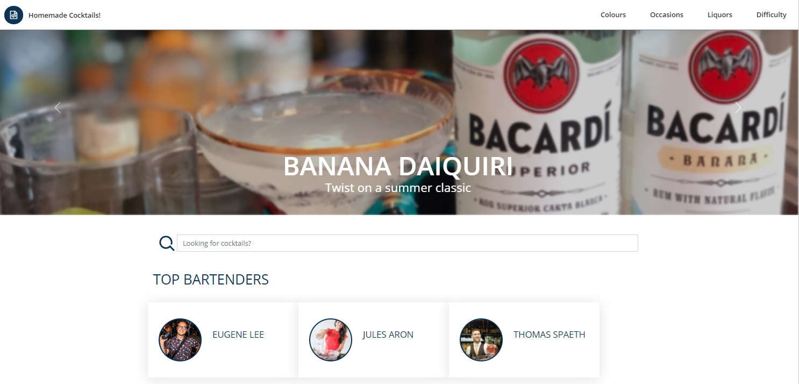

[](https://www.contentstack.com/)


# Demo Cocktail 🍸 Site Project using ContentStack and Next.js

1. Get a trial from contentstack.com

2. Change region if not NA

```
csdx config:set:region EU 
```

3. Install the CLI and login 

```
csdx auth:login
```

4. Create a management token from your trial

5. Import the content from the content-export directory

```
csdx cm:import -A -s <stack_ApiKey> -l <master_language_code> -d content-export
```

6. Create a delivery token from your trial and configure the .local.env file from the .sample.env template

7. Run the app:

```
npm run dev
```




## Documentation

You can see example of use of the SDK and the API from the src/contentstack directory

Read Contentstack [docs](https://www.contentstack.com/docs/)

Learn about [Next.js](https://learnnextjs.com/)


